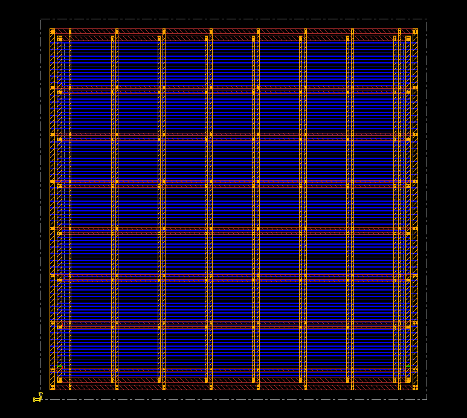
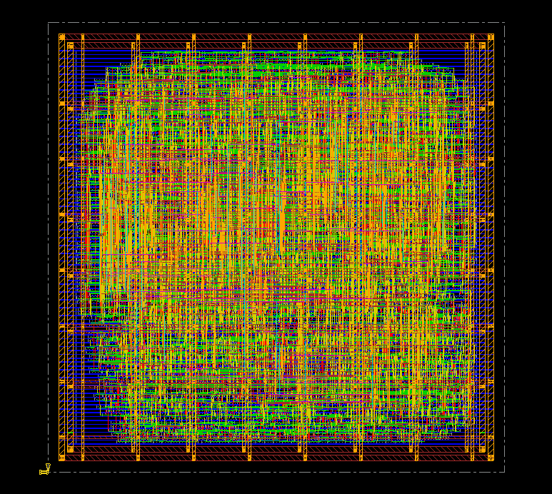
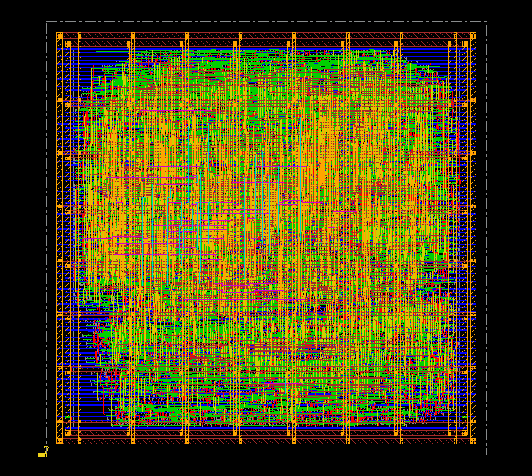

# RTL-to-GDSII Implementation of PicoRV32 Core (45nm)

## Objective
To execute an end-to-end ASIC physical design flow for the open-source RISC-V PicoRV32 core, achieving maximum Power, Performance, and Area (PPA) optimization with zero setup/hold and DRC violations.

## Tools & Technology
* **Logic Synthesis:** Cadence Genus
* **Place & Route (PNR):** Cadence Innovus
* **Technology Node:** Nangate 45nm Open Cell Library

## Visual Layout Progression
**1. Power Grid Design (Rings, Stripes, and Follow-Pins)**

**2. Standard Cell Placement**

**3. Final Routing (NanoRoute)**

## PPA Results & Sign-off Metrics
| Metric | Target | Achieved |
| :--- | :--- | :--- |
| **Clock Frequency** | 500 MHz (2.0ns) | **687 MHz (1.45ns)** |
| **Setup WNS (Post-Route)** | > 0.000 ns | **+0.545 ns** |
| **Core Density** | 70% | **70.85%** |
| **Routing Congestion** | < 1% | **0.01%** |
| **DRC / LVS Violations** | 0 | **0** |

## The Physical Design Flow
1. **Logic Synthesis:** Synthesized behavioral Verilog into a gate-level netlist mapped to 45nm standard cells.
2. **Floorplanning & Power Grid:** Defined core utilization, placed macros, and designed a robust VDD/VSS power ring and stripe mesh (metal5/metal6).
3. **Placement:** Executed timing-driven standard cell placement to minimize wire length and congestion.
4. **Clock Tree Synthesis (CTS):** Configured CCOpt engine with explicitly defined buffer libraries to achieve a single-stage clock depth with sub-40ps leaf slew.
5. **Routing (NanoRoute):** Performed global and detail routing of all signal nets across 8 metal layers.
6. **Sign-off:** Executed Multi-Mode Multi-Corner (MMMC) Static Timing Analysis with On-Chip Variation (OCV) and Signal Integrity (SI) crosstalk checks enabled.
